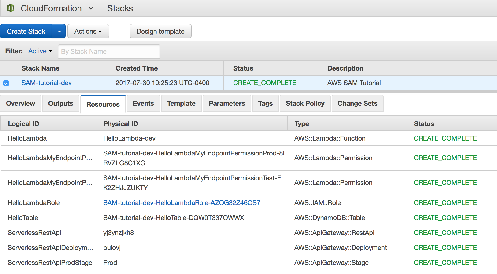

# AWS SAM Tutorial

This tutorial uses AWS SAM to create a hello-world Serverless app with API Gateway, Lambda, and DynamoDB.

Start with the first commit. Then `Checkout` the next commit when you're ready to move onto the next step.

## Add a Stage

The Serverless Framework made it easy to deploy to different Stages/Environments like Dev, QA, and Prod. 

With AWS SAM, you'll have to rely on conventional methods for Stage deployment.

In this commit, you add a CloudFormation Parameter called `Environment`:

```
Parameters:
  Environment:
    Type: String
```

Then you can dereference `Environment` by using the Substitute function:

```
      FunctionName: !Sub HelloLambda-${Environment}
```

You pass the `Environment` paremeter into CloudFormation via the `deploy` command:

```
aws cloudformation deploy                     \
    --template-file build/output.yaml         \
    --stack-name $PROJECT                     \
    --capabilities CAPABILITY_IAM             \
    --parameter-overrides Environment=$STAGE
```

The `$STAGE` variable is defined at the top of `deploy.sh`:

```
STAGE=${1:-dev}
```

This basically says that `STAGE` is set to the first argument. e.g. `./deploy.sh qa`

If no argument is given, e.g. `./deploy.sh`, it defaults to `dev`.

Also, the `PROJECT` and `BUCKET` include the Stage suffix so that stack and bucket names are unique.

```
PROJECT=SAM-tutorial-$STAGE
```

## Build and run

Delete the `SAM-tutorial` CloudFormation stack.

Then deploy a new **Dev** stack:

```
./deploy.sh
```

Go to API Gateway > Dashboard and get the URL.

Visit the URL, and the table results should be empty.

Also, go to CloudFormation > SAM-tutorial-dev > Resources tab, and note that each resource has the `-dev` suffix.



## Next step

`Checkout` the next commit when you're ready to move onto the next step.